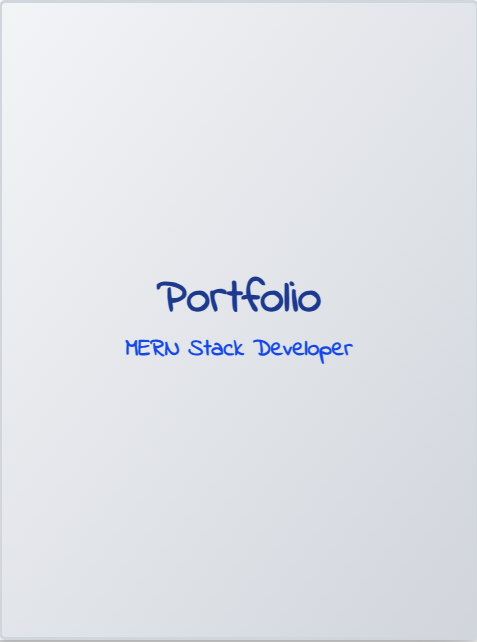

<h1 align="center">📖 Interactive Portfolio Flipbook</h1>

<p align="center">
  
  
  
</p>

---

## ✨ About the Project

This is a **MERN Stack Developer Portfolio** presented in a **realistic page-flipping book style** 📚.  
It’s an **interactive showcase** of skills, projects, and achievements — just like flipping through a real portfolio.  

The project uses:
- **React** for the UI  
- **Tailwind CSS** for styling  
- **HTML FlipBook** for the page-turning effect  
- A **handwriting-style font** for a personal touch ✍️  

---

## 📸 Screenshots

| Portfolio Cover | Certifications Page | Education Page |
|-----------------|----------------------|----------------|
|  |  |  |

---

## 🚀 Features

✅ Realistic **page flip animation**  
✅ Handwritten-style typography for a creative look  
✅ **Certificates with taped & tilted effect** for a scrapbook vibe  
✅ Education page with an **image & tape corners**  
✅ Clean, responsive design for all devices  
✅ All sections: Summary, Skills, Education, Certifications, Projects, Experience, Languages  

---

## 🛠️ Tech Stack

- **Frontend:** React, Tailwind CSS, Framer Motion
- **Page Flip:** [`react-pageflip`](https://www.npmjs.com/package/react-pageflip)
- **Styling Helpers:** DaisyUI (optional)
- **Fonts:** [Patrick Hand](https://fonts.google.com/specimen/Patrick+Hand) from Google Fonts

---

## 📂 Folder Structure

📦 my-portfolio-flipbook <br/>
┣ 📂 public <br/>
┃ ┣ main-logo.svg <br/>
┃ ┣ freecodecamp-cert.png <br/>
┃ ┣ google-digital-garage-cert.png <br/>
┃ ┣ cover.png <br/>
┃ ┣ edu page.png <br/>
┃ ┣ certificate page.png <br/>
┃ ┗ education-photo.png <br/>
┣ 📂 src <br/>
┃ ┣ 📜 App.jsx <br/>
┃ ┣ 📜 SimpleBook.jsx <br/>
┃ ┗ 📜 index.css <br/>
┣ 📜 package.json <br/>
┗ 📜 README.md <br/>

## ⚡ Installation & Setup

```bash
# 1️⃣ Clone the repo
git clone https://github.com/fahimahmed420/portfolio-notebook-style

# 2️⃣ Navigate to project folder
cd portfolio-flipbook

# 3️⃣ Install dependencies
npm install

# 4️⃣ Run the development server
npm start